# Phase 1 & 2 - Lab Planning, Windows Server Installation & Domain Controller Setup

# Enterprise IT Infrastructure Lab

## Overview

Before building an enterprise network, it is important to plan the environment and prepare the first server.

In these phases, we designed the lab, installed Windows Server 2022, configured the basic network settings, and promoted the server to a **Domain Controller** using **Active Directory Domain Services (AD DS)**.

This server will become the foundation of the entire project. Every service we configure in the following phases, such as DNS, DHCP, Group Policy, and File Server, will rely on this Domain Controller.

---

# Goal of These Phases

The goal was to build a stable Windows Server environment that can be used as the central management server for a company.

After completing these phases, we have:

* Planned the lab environment
* Installed Windows Server 2022
* Configured a static IP address
* Renamed the server
* Installed Active Directory Domain Services (AD DS)
* Promoted the server to a Domain Controller
* Created a new Active Directory forest and domain

---

# Lab Environment

| Item             | Value               |
| ---------------- | ------------------- |
| Company          | TechNova Solutions  |
| Server Name      | TECH-DC01           |
| Operating System | Windows Server 2022 |
| Domain Name      | technova.local      |
| Server Role      | Domain Controller   |

---

# Why Is Planning Important?

Planning helps avoid problems later in the deployment.

Before installing Windows Server, we decided:

* What the server will be used for
* The domain name
* The server name
* The network configuration
* The project structure for documentation

Good planning makes the environment easier to manage and expand.

---

# Step 1 - Create the Virtual Machine

A virtual machine was created using Oracle VirtualBox.

Recommended settings:

| Setting          | Value                                  |
| ---------------- | -------------------------------------- |
| Operating System | Windows Server 2022                    |
| RAM              | 2048 MB                                |
| CPU              | 1 Processor                            |
| Storage          | 40 GB                                  |
| Network          | NAT or Bridged (depending on your lab) |

**Expected Result**

A virtual machine is ready for Windows Server installation.

**Screenshot**

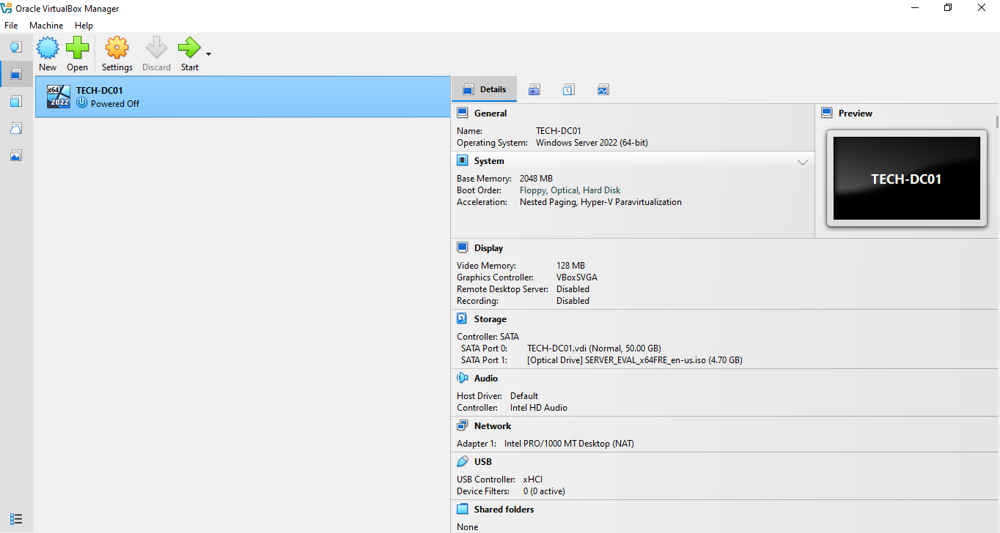

---

# Step 2 - Install Windows Server 2022

Windows Server 2022 was installed inside the virtual machine.

During installation:

* Selected Windows Server 2022 Standard (Desktop Experience)
* Accepted the license agreement
* Selected a new virtual disk
* Completed the installation

**Expected Result**

Windows Server boots successfully.

**Screenshot**

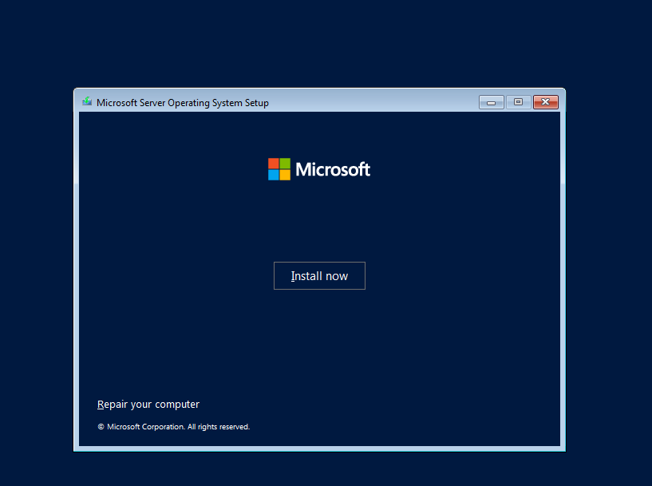 
 
 
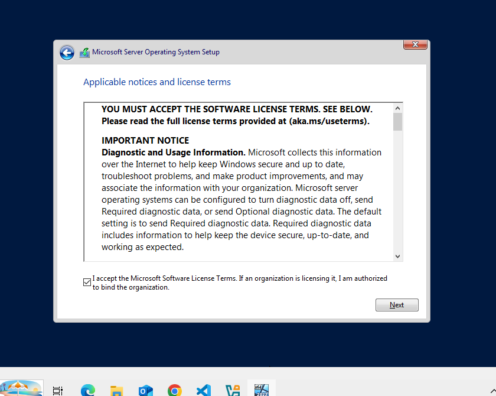 
 
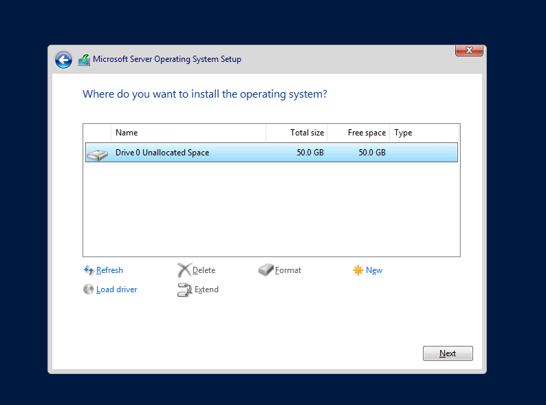 
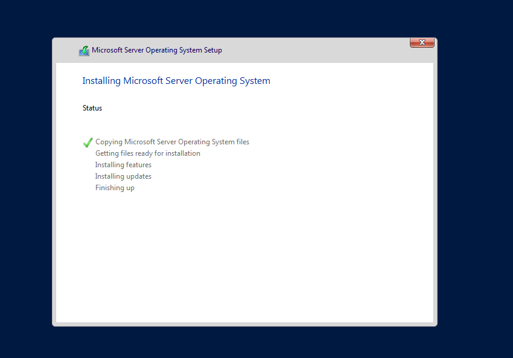 
 
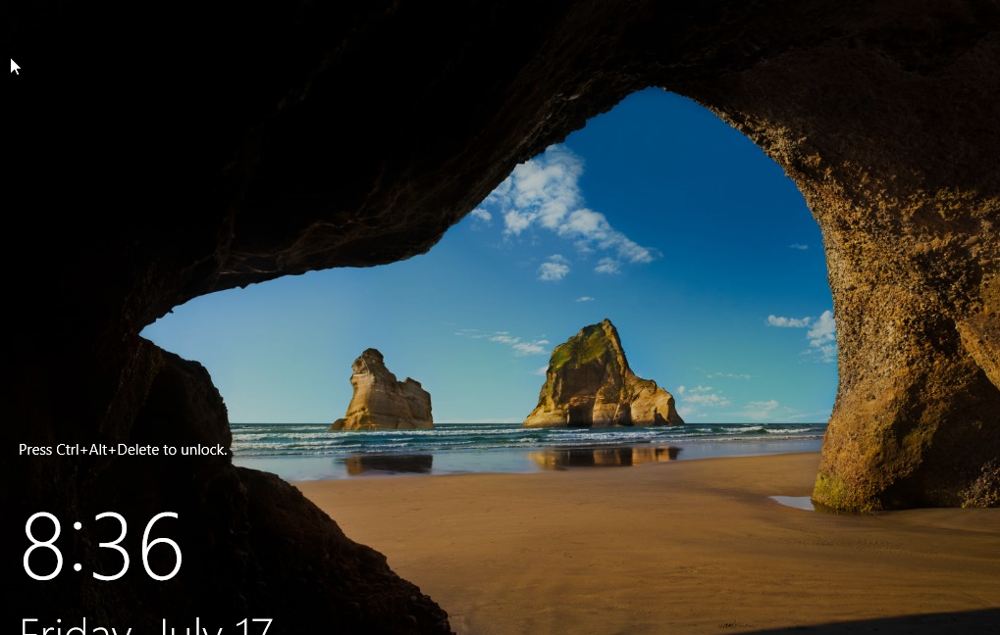

---

# Step 3 - Configure a Static IP Address

A Domain Controller should always use a static IP address.

Example configuration:

| Setting       | Example       |
| ------------- | ------------- |
| IP Address    | 192.168.1.10  |
| Subnet Mask   | 255.255.255.0 |
| Gateway       | 192.168.1.1   |
| Preferred DNS | 192.168.1.10  |

**Why?**

If the server's IP address changes, clients may not be able to locate the Domain Controller.

**Verification**

Open Command Prompt and run:

```cmd
ipconfig
```

Check that the static IP address is configured correctly.

**Screenshot**


---

# Step 4 - Rename the Server

The default computer name was changed to:

```text
TECH-DC01
```

A meaningful server name makes administration easier, especially in environments with multiple servers.

**Verification**

Open:

**Server Manager → Local Server**

Confirm the server name is **TECH-DC01**.

**Screenshot**

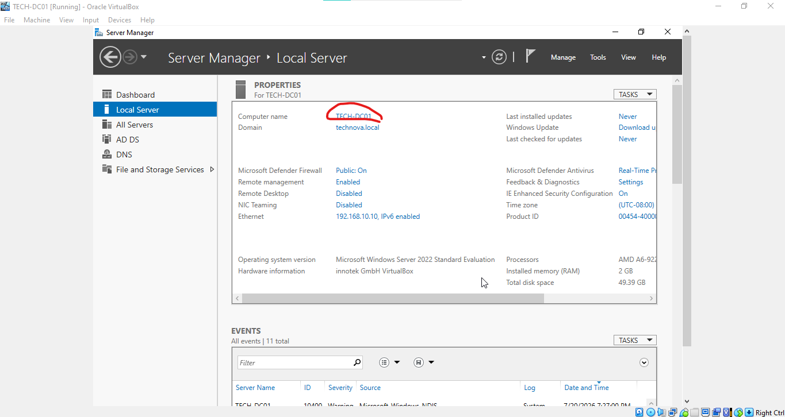

---

# Step 5 - Install Active Directory Domain Services (AD DS)

The **Active Directory Domain Services** role was installed using **Server Manager**.

Navigation:

```text
Server Manager
→ Add Roles and Features
→ Active Directory Domain Services
```

After installation, the server was ready to be promoted to a Domain Controller.

**Screenshot**


 
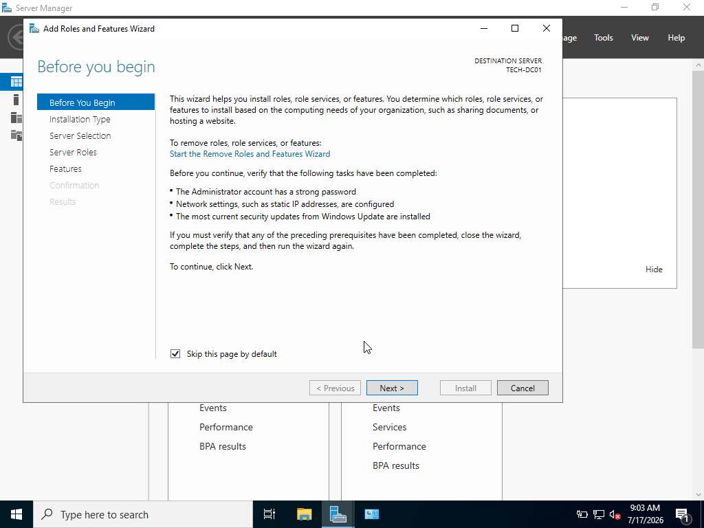 
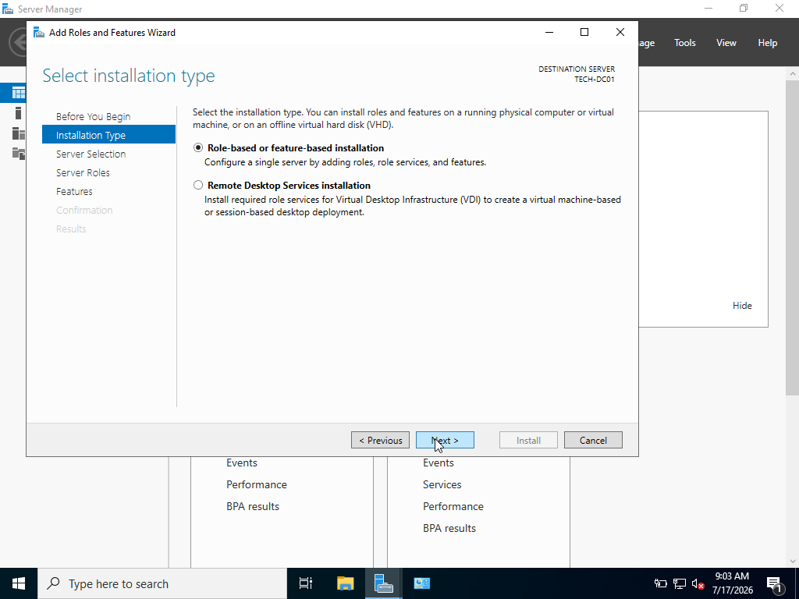 
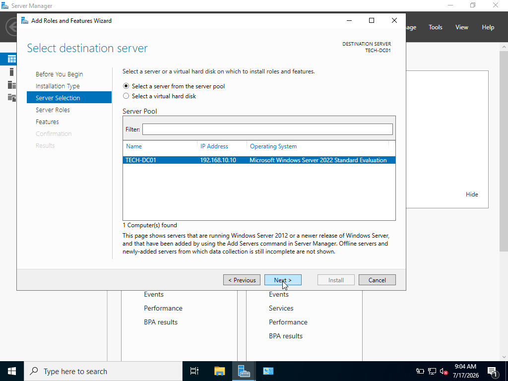 
 
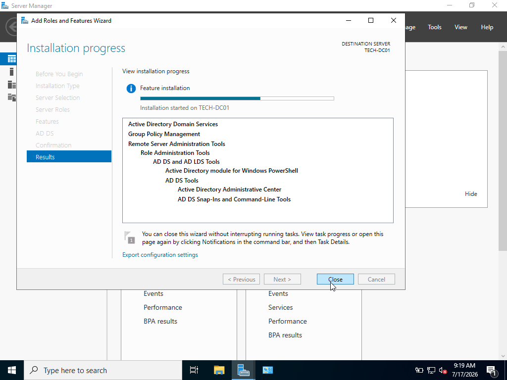 


---

# Step 6 - Promote the Server to a Domain Controller

After installing AD DS, the server was promoted to a Domain Controller.

Configuration used:

| Setting          | Value                   |
| ---------------- | ----------------------- |
| Deployment       | Add a new forest        |
| Root Domain      | technova.local          |
| Functional Level | Windows Server 2022     |
| DNS              | Installed automatically |

The server restarted automatically after the promotion.

**Expected Result**

The server becomes the first Domain Controller for the new domain.

**Screenshot**

 
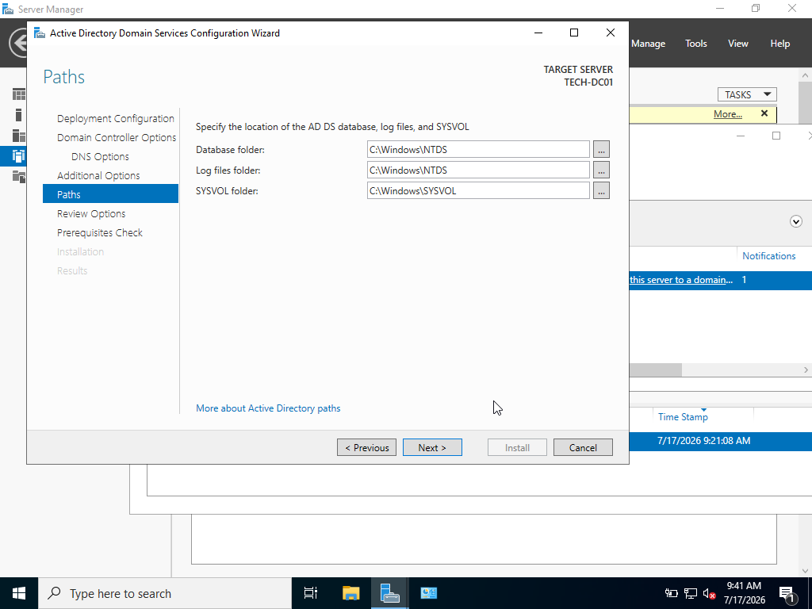 
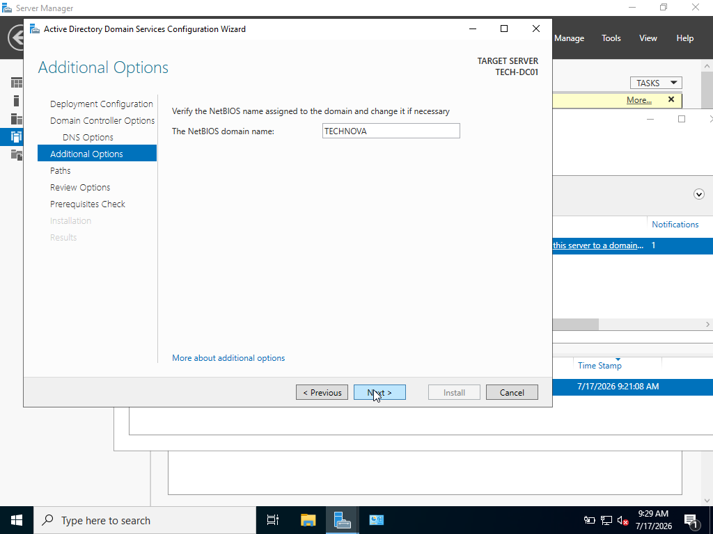 
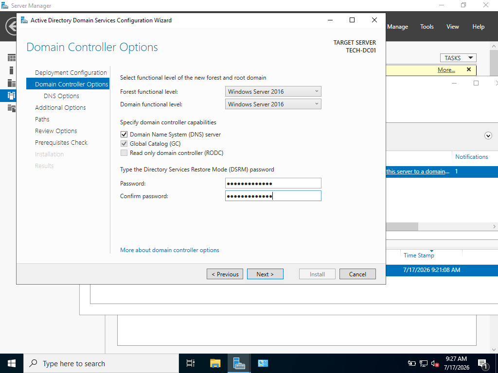 
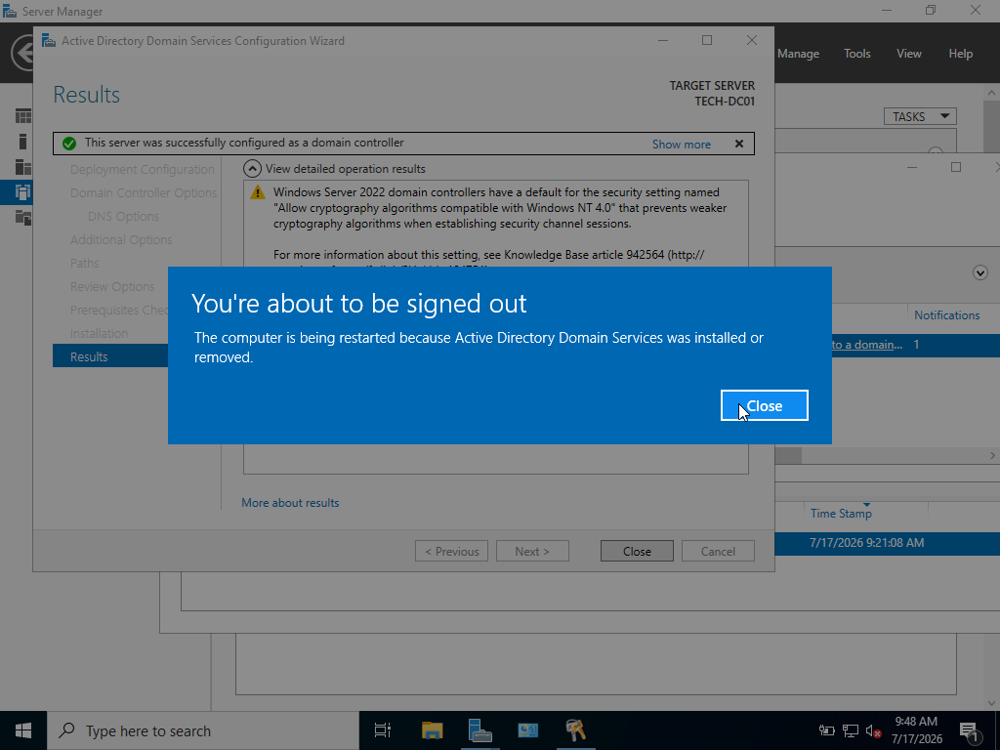

---

# Step 7 - Verify the Installation

After restarting:

* Logged in using the domain administrator account.
* Opened **Server Manager**.
* Confirmed the AD DS role was installed.
* Opened **Active Directory Users and Computers**.
* Verified that the **technova.local** domain was created successfully.

**Screenshot**

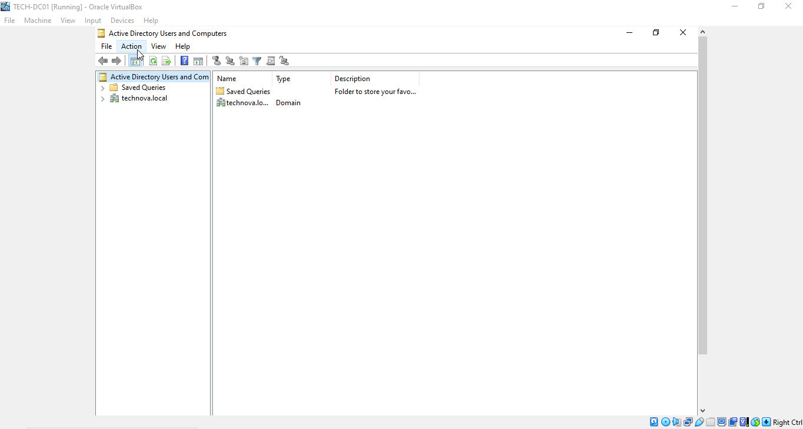

---

# What We Learned

In these phases we learned how to:

* Plan a Windows Server lab
* Install Windows Server 2022
* Configure a static IP address
* Rename a server
* Install Active Directory Domain Services
* Promote a server to a Domain Controller
* Create a new Active Directory domain

These are fundamental tasks for Windows Server administrators and provide the foundation for the remaining phases of the project.

---

# Skills Demonstrated

* Windows Server Installation
* Virtual Machine Deployment
* Server Configuration
* Static IP Configuration
* Active Directory Domain Services (AD DS)
* Domain Controller Deployment
* Basic Network Configuration
* Windows Server Administration

---

# Conclusion

At the end of these phases, the lab environment is fully prepared with a functioning Domain Controller.

This server will act as the central point for authentication, user management, and network services throughout the rest of the project.

The next phase focuses on designing the Active Directory structure by creating Organizational Units (OUs), Security Groups, and user accounts.

---

# Next Phase

➡️ **Phase 3 – Active Directory Organizational Structure & User Management**

In the next phase we will:

* Create Organizational Units (OUs)
* Create Security Groups
* Create User Accounts
* Organize users by department
* Prepare the environment for Group Policy and File Server permissions
