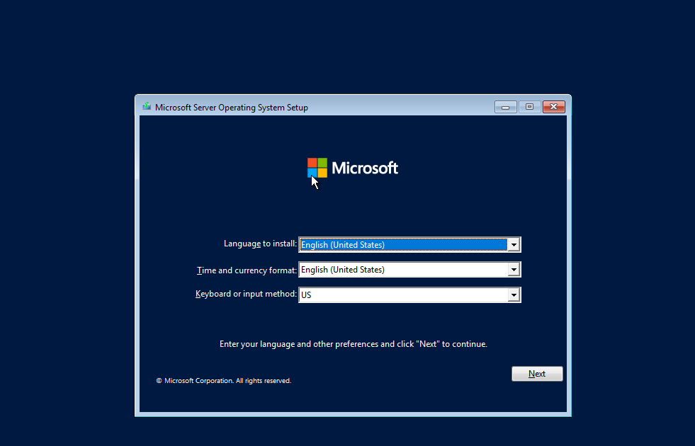
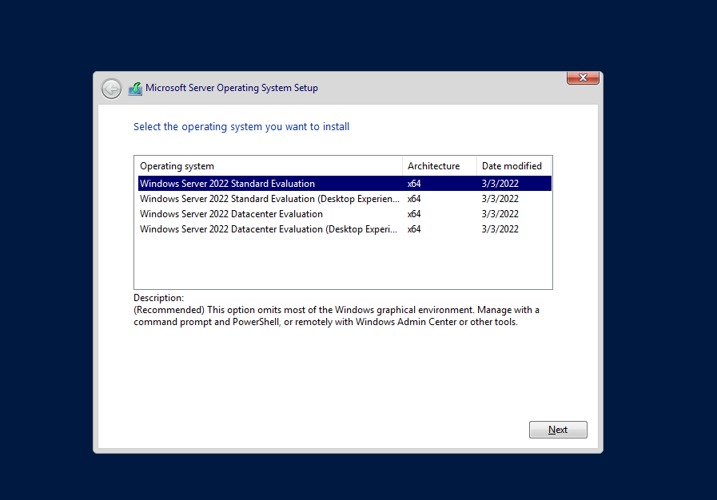
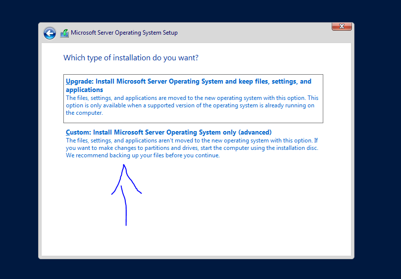
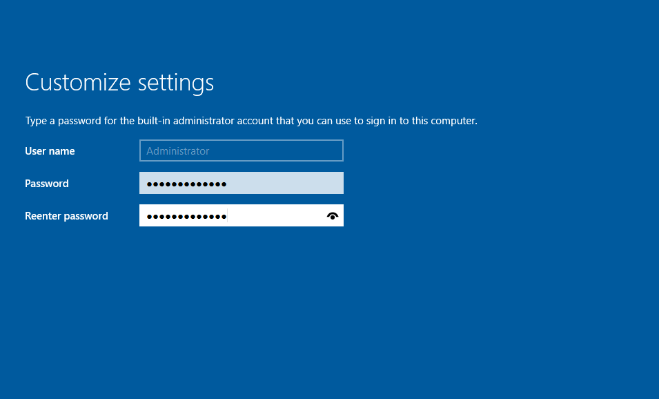
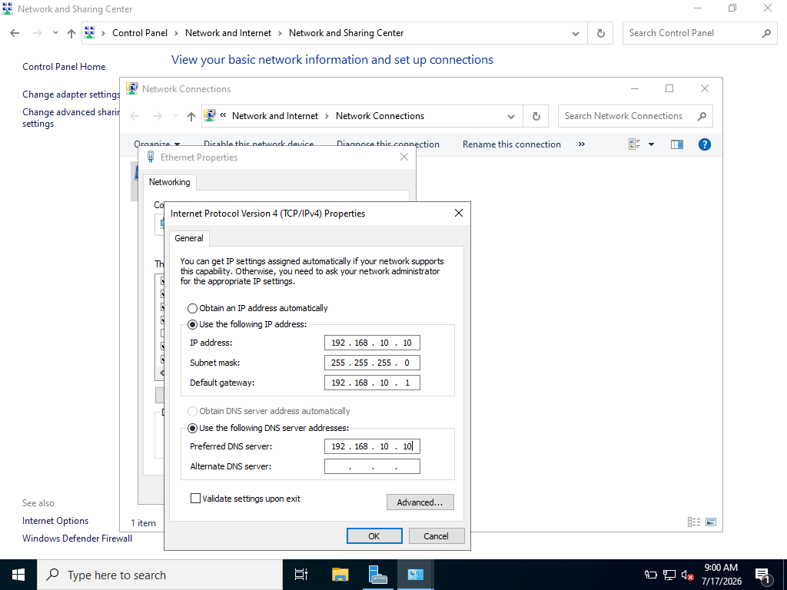
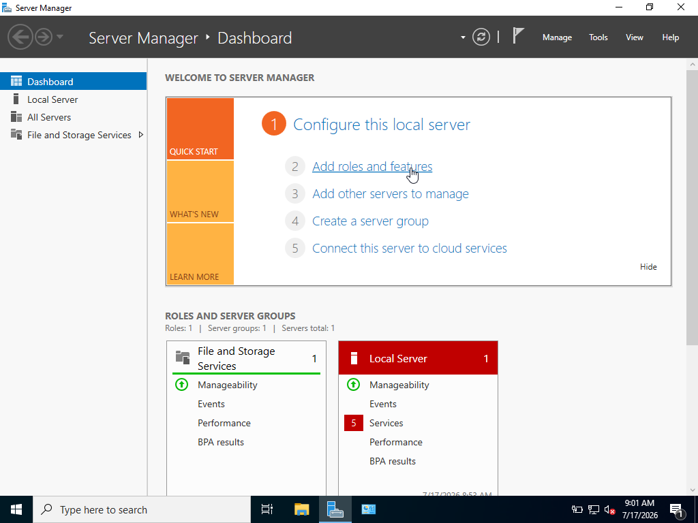
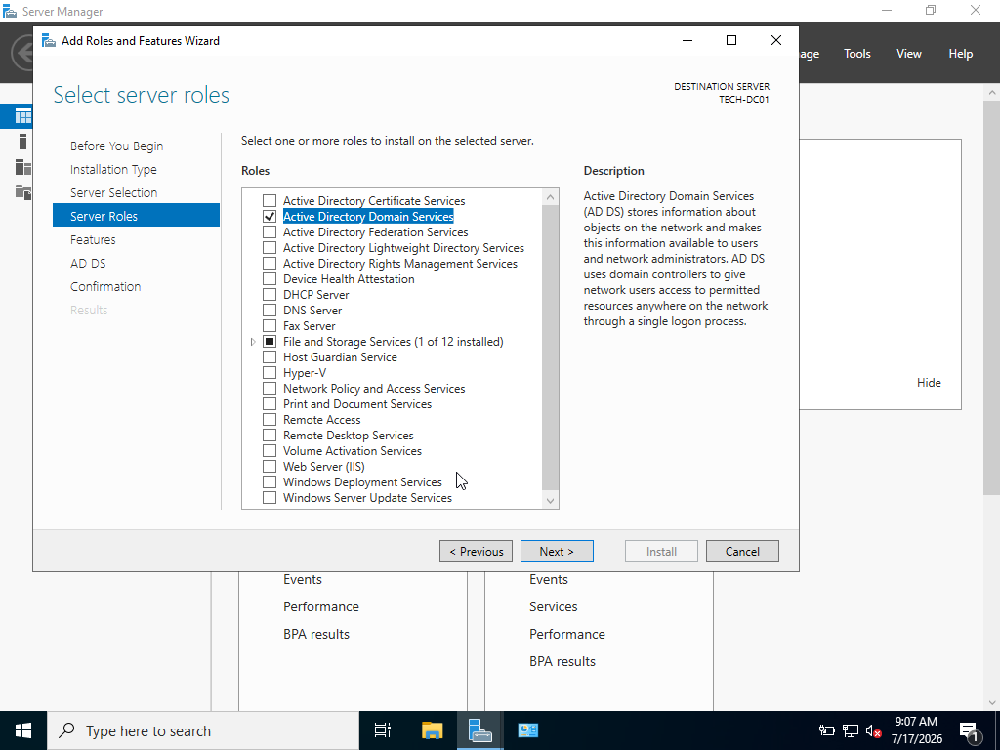
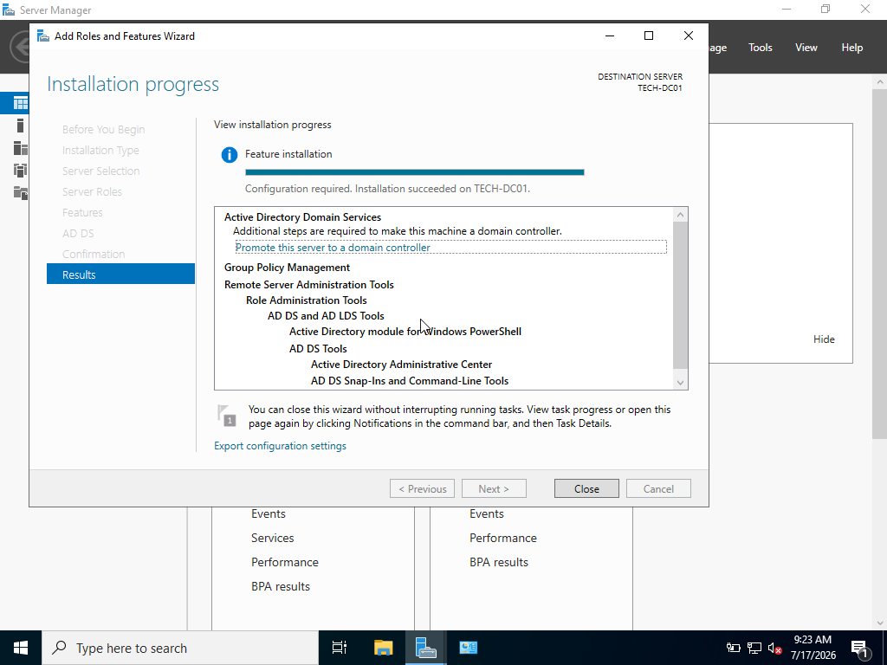
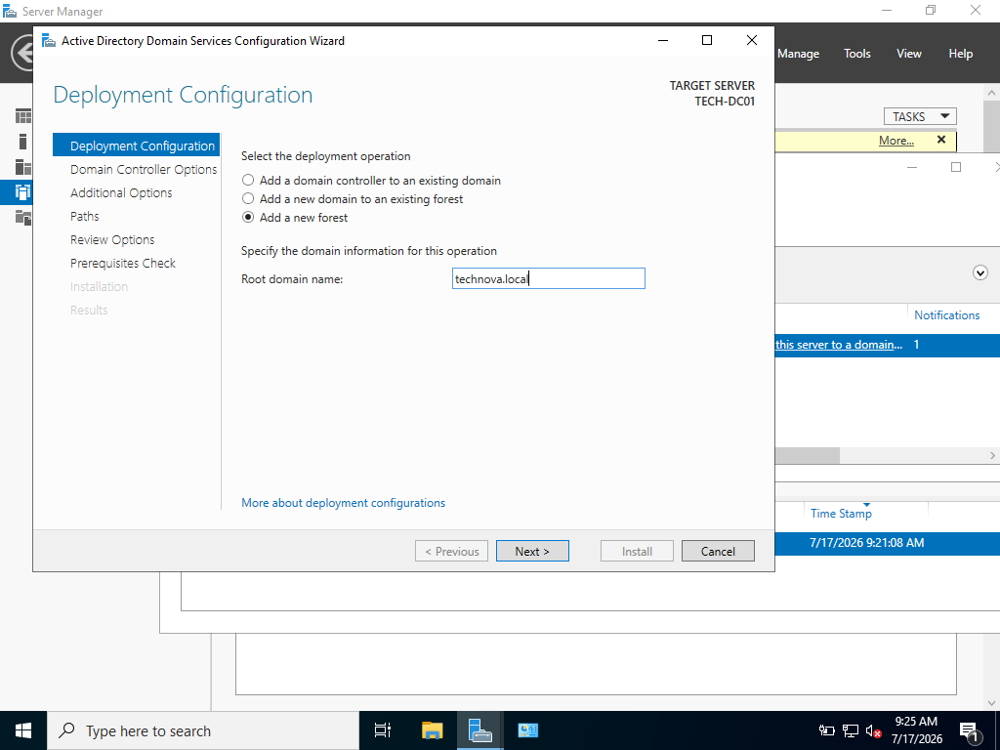

# Windows Server Domain Controller Deployment

## Project: Enterprise Windows Network Infrastructure Lab

## Overview

This phase focuses on deploying the first server in the TechNova Solutions enterprise environment. The server is configured as a **Domain Controller (DC)** using Windows Server 2022.

The Domain Controller provides centralized identity management, authentication, and DNS services for the organization.

---

# Objectives

The objectives of this phase are:

* Deploy Windows Server 2022 in a virtual environment
* Configure a static IP address
* Rename and prepare the server
* Install Active Directory Domain Services (AD DS)
* Configure the first Active Directory forest
* Enable DNS services
* Verify domain functionality
* Document the deployment process

---

# Lab Environment

## Company Information

**Company Name:**
TechNova Solutions

**Environment Type:**
Virtual Enterprise Lab

**Purpose:**
Practice Windows Server administration and enterprise infrastructure management.

---

# Server Information

| Item             | Configuration                           |
| ---------------- | --------------------------------------- |
| Server Name      | TECH-DC01                               |
| Operating System | Windows Server 2022 Standard Evaluation |
| Server Role      | Domain Controller                       |
| Domain Name      | technova.local                          |
| IP Address       | 192.168.10.10                           |
| Subnet Mask      | 255.255.255.0                           |
| Default Gateway  | 192.168.10.1                            |
| DNS Server       | 192.168.10.10                           |

---

# Virtual Machine Configuration

## Hypervisor

Virtualization Platform:

Oracle VirtualBox

## Hardware Allocation

| Resource        | Value             |
| --------------- | ----------------- |
| Memory          | 2048 MB RAM       |
| CPU             | 1 Core            |
| Storage         | 40 GB Dynamic VDI |
| Network Adapter | Host-Only Adapter |

---

# Installation Process

## 1. Create Virtual Machine

A new virtual machine was created with the following configuration:

* Name: TECH-DC01
* Operating System: Windows Server 2022
* RAM: 2 GB
* Storage: 40 GB

The Windows Server ISO file was attached and the installation process was started.

---

# 2. Install Windows Server

Installation options:

* Language: English

* Edition: Windows Server 2022 Standard Evaluation

* Installation Type: Custom Installation

* Installation Mode: Desktop Experience

Desktop Experience was selected to provide a graphical management interface for administration tasks.

---

# 3. Configure Administrator Account


The built-in Administrator account was configured with a strong password.

The administrator account is used for initial server configuration and domain management.

---

# 4. Rename Server

The default Windows computer name was changed.

Old Name:

```
Random Windows Generated Name
```

New Name:

```
TECH-DC01
```

Reason:

Following enterprise naming standards makes servers easier to identify and manage.

---

# 5. Configure Static IP Address

A Domain Controller requires a static IP address because other devices depend on it for authentication and DNS resolution.

Network Configuration:

```
IP Address:
192.168.10.10

Subnet Mask:
255.255.255.0

Gateway:
192.168.10.1

DNS:
192.168.10.10
```



---

# 6. Install Active Directory Domain Services

Active Directory Domain Services was installed using Server Manager.

Installation Path:

```
Server Manager

→ Add Roles and Features



→ Active Directory Domain Services



→ Install
```


Required management tools were installed automatically.

---

# 7. Promote Server to Domain Controller

After installing AD DS, the server was promoted to a Domain Controller.

Configuration:

```
Deployment Type:
Add a new forest



Root Domain Name:
technova.local
```

The following services were installed:

* Active Directory Domain Services
* DNS Server

---

# Active Directory Domain Information

Domain:

```
technova.local
```

Domain Controller:

```
TECH-DC01
```

Purpose:

The domain provides centralized authentication and management for company users and computers.

---

# Verification and Testing

## Verify Domain

PowerShell command:

```powershell
Get-ADDomain
```

Expected Result:

```
technova.local
```

---

## Verify DNS

Open:

```
Server Manager

→ Tools

→ DNS
```

Confirm that DNS zones exist for:

```
technova.local
```

---


# Troubleshooting Notes

## Issue: Cannot Promote Server to Domain Controller

Possible Causes:

* Incorrect DNS configuration
* Invalid domain name
* Network adapter problems

Solution:

Verify:

```
Preferred DNS = Server IP Address
```

Example:

```
192.168.10.10
```

---

## Issue: Domain Login Not Available

Possible Causes:

* Server restart required
* Active Directory installation incomplete

Solution:

Restart the server and verify:

```
TECHNOVA\Administrator
```

---

# Skills Demonstrated

This phase demonstrates:

* Windows Server installation
* Virtual machine deployment
* IP addressing
* Server naming standards
* Active Directory deployment
* DNS configuration
* Enterprise server administration
* Technical documentation

---

# Next Phase

## Phase 3: Active Directory Structure Design

The next phase will include:

* Organizational Units (OU)
* User accounts
* Security groups
* Department structure
* Permission planning
* Enterprise user management
